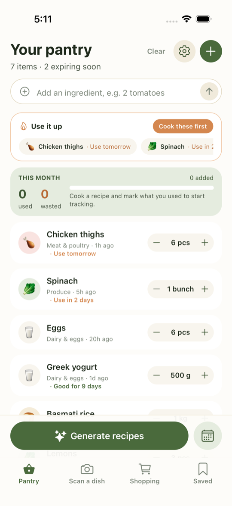
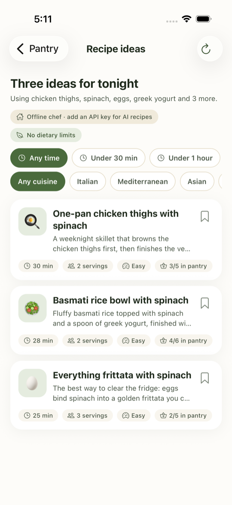
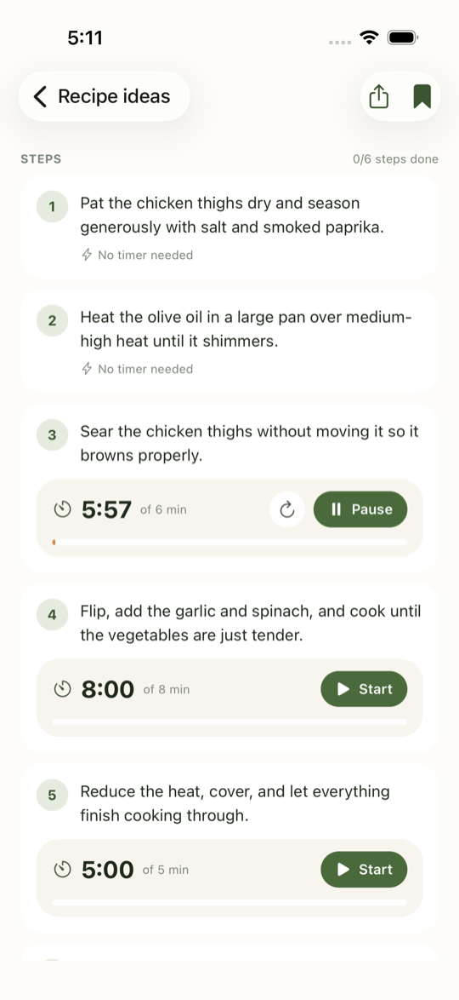
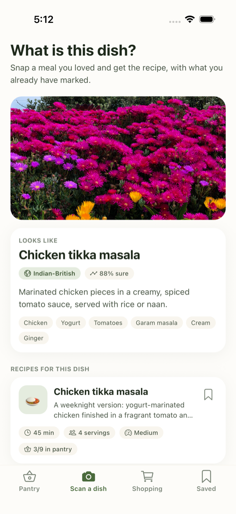
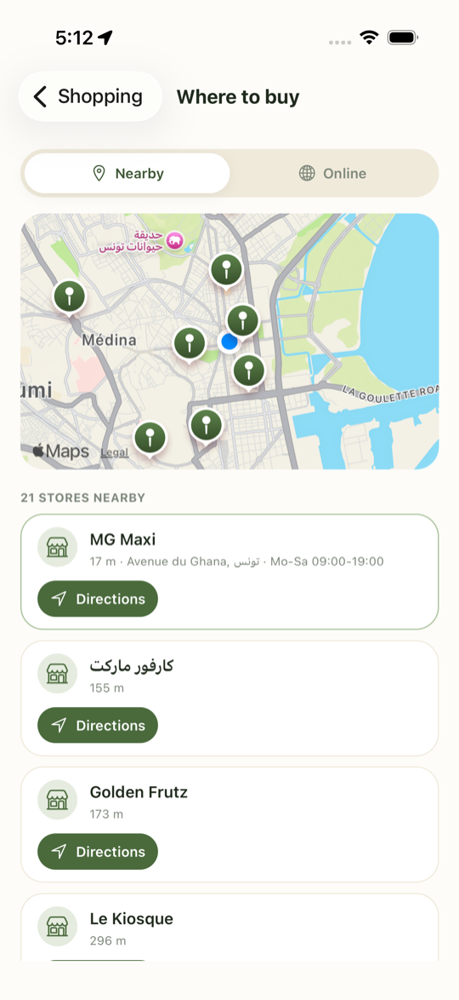

<p align="center">
  
</p>

<h1 align="center">PantryChef</h1>

<p align="center">
  Turn what is already in your fridge into tonight's dinner, and throw less food away.
</p>

PantryChef is a mobile app for people who want to waste less food. You keep a
light-weight list of what you have at home, and the app does the rest: it warns
you before things expire, suggests recipes that use them up, builds a shopping
list for the gaps, plans your week, and even names a dish from a photo and
tells you how to cook it. With a Claude API key the recipes and photo analysis
are done by Claude. Without one, a built-in offline chef and simulated scans
keep every screen working.

## Five things it does

<table>
  <tr>
    <td align="center" width="33%"><br /><b>Know what you have</b><br /><sub>Your pantry with use-by hints, a "Use it up" strip for what expires soon, and a monthly used-versus-wasted tracker.</sub></td>
    <td align="center" width="33%"><br /><b>Get recipes from your pantry</b><br /><sub>Three ideas that use up what you have, with time and cuisine filters and your diet respected.</sub></td>
    <td align="center" width="33%"><br /><b>Cook with timers</b><br /><sub>Step-by-step instructions with a countdown on every step that needs one, then "I cooked this" to deduct what you used.</sub></td>
  </tr>
  <tr>
    <td align="center" width="33%"><br /><b>Name a dish from a photo</b><br /><sub>Snap a meal and get its name, cuisine and a recipe to make it at home. Shown here in offline simulation; with a Claude API key the photo is really analysed.</sub></td>
    <td align="center" width="33%"><br /><b>Find where to buy</b><br /><sub>Supermarkets near you on a map with distances and directions, or online grocers for your region with your list copied.</sub></td>
    <td width="33%"></td>
  </tr>
</table>

## Features

**Pantry**
- Quick add by name, with automatic categories and emoji.
- Quantity steppers, swipe to remove, use-by dates with "use today" and "good for 9 days" hints.
- A "Use it up" strip for anything expiring within three days.
- Expiry reminders as local notifications the day before.
- A monthly tracker of items used versus wasted.

**Adding items**
- Type it in, with unit, category and use-by presets.
- Photograph your groceries and pick from the detected items.
- Photograph a receipt and every food line becomes an item.
- Scan a barcode or type the number; products are looked up on Open Food Facts.

**Recipes**
- Three ideas from your pantry, prioritising what expires first.
- Time and cuisine filters, and a diet and avoid list that every recipe respects.
- Servings scaler that rescales amounts, including fractions.
- Step-by-step cooking view with a countdown timer per step, kept awake while you cook.
- "Add missing items to shopping list", "I cooked this" to deduct what you used, sharing and bookmarks.

**Scan a dish**
- Take a photo of a meal and get its name, cuisine, key ingredients and recipes to make it, with your pantry marked.

**Shopping**
- Shopping list with tick-off; bought items move straight into the pantry.
- "Where to buy": supermarkets within three kilometres on a map with distances, opening hours and directions (OpenStreetMap data), and region-aware online grocers that open with your list copied.

**Planning and preferences**
- Weekly plan of five dinners with a one-tap shopping list for the gaps.
- Vegetarian, vegan, pescatarian, halal, kosher and gluten-free diets, plus allergens and a custom avoid list.
- English, French and Arabic.

## Tech stack

| Layer | Choice |
| --- | --- |
| Framework | React Native with Expo SDK 54, Expo Router (file-based navigation) |
| Language | TypeScript |
| Styling | NativeWind (Tailwind CSS) with a warm green and cream palette |
| State | Zustand stores persisted to AsyncStorage |
| AI | Claude via `@anthropic-ai/sdk` with structured outputs, plus offline fallbacks |
| Data | Open Food Facts (barcodes), OpenStreetMap Overpass (stores), Apple Maps |
| Native | expo-notifications, expo-camera, expo-location, expo-image-picker, react-native-maps |
| Tests | XCUITest suite driving the real app on the iOS simulator |

## Getting started

```bash
npm install
npx expo run:ios        # first build: generates ios/, installs pods, launches the simulator
```

After the first native build, `npx expo start` is enough for day-to-day work.

### Claude API key (optional)

Copy `.env.example` to `.env` and set `EXPO_PUBLIC_ANTHROPIC_API_KEY`. With a key,
recipes, dish photos, receipts and the weekly plan are produced by Claude. Without
one, the offline chef and simulated scans are used and the screens say so.

Keys prefixed `EXPO_PUBLIC_` are bundled into the app. Use a backend proxy before
shipping publicly.

## Tests

```bash
npm run test:ui       # seven end-to-end UI tests on the iPhone 17 Pro simulator
npm run screenshots   # refreshes docs/screenshots by walking every screen
```

The UI tests inject an XCUITest target into the generated iOS project (sources in
`e2e/ios`) and drive the real app: adding items, photo and receipt scans, barcode
lookup, recipe generation and filters, the cooking view with timers, the shopping
list and store finder, the weekly plan, settings and the language switch. Metro
must be running.

## Project structure

```
app/            routes: tabs (pantry, scan, shopping, saved), add-item, barcode,
                settings, plan, stores, recipes list and detail
components/     UI kit, inventory rows, recipe cards, step timers
store/          persisted Zustand stores: inventory, recipes, shopping, settings, stats
services/       Claude client, offline chef, vision, receipt, dish, planner,
                notifications, barcode, stores
lib/            i18n dictionaries, categoriser, amount scaler, utilities
e2e/ios/        XCUITest sources; scripts/ injects them into the Xcode project
assets/brand/   SVG sources for the logo; PNGs in assets/ are rendered from them
```

## Branding

The logo is a chef's hat with a leaf on a sage gradient. After changing the SVGs
in `assets/brand`, re-render the PNGs and run `npx expo prebuild --platform ios --clean`.
